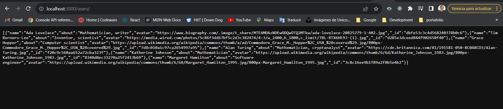
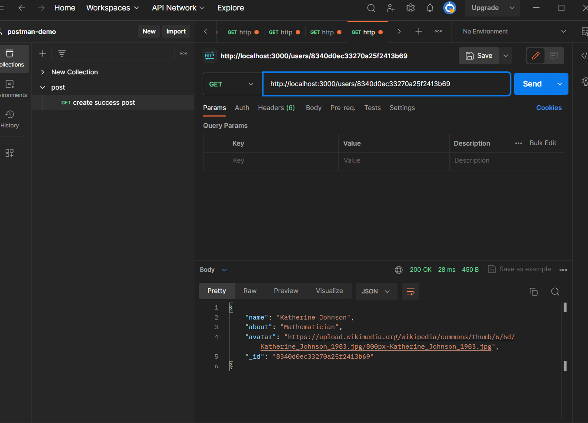
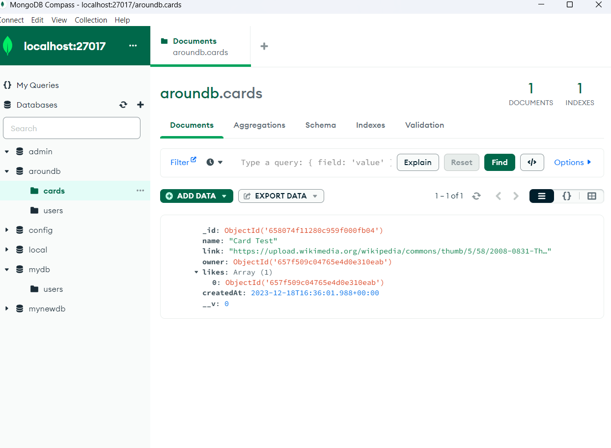
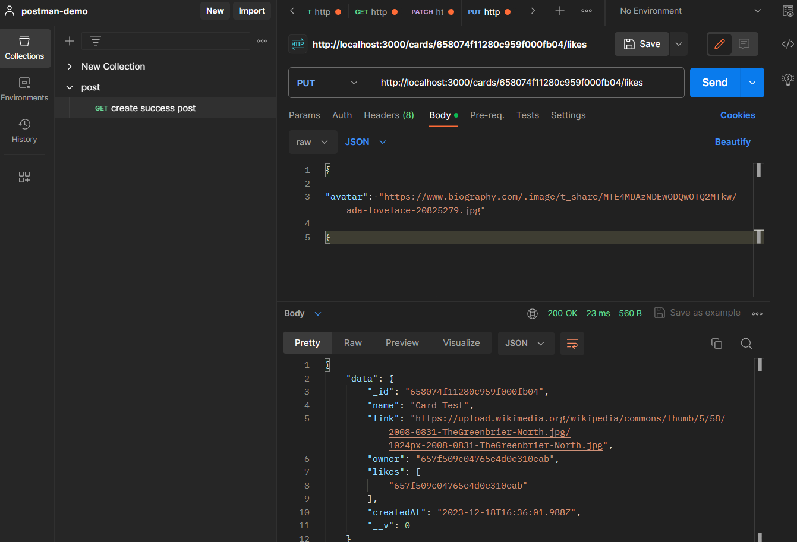

# Tripleten web_project_around_express

### Descripción general

- Autor
- Introduccion
- Tecnologias Utilizadas
- Imágenes
- Enlace web - Github page

# Autor

    Carlos Gómez
    'cgomezhub'
    cgomezlugo@hotmail.com
    058 416 953 4983

**Introducción**

Este es un proyecto se pone nuevamente en practica la teoria de modulos de Node.js basados en el framework Express.js para crer un servidor de prueba. Se importan los modolos express, fs y path y con sus respectivas funcionalidades Router, readfile entre otros.

Tambien se pone en practica MongoDB, que es una base de datos NoSQL orientada a documentos, lo que significa que almacena datos en un formato similar a JSON (en realidad BSON, una versión binaria de JSON).

Asi mismo mediante Mongoose, una biblioteca de JavaScript que proporciona una solución de modelado de datos para aplicaciones basadas en Node.js y MongoDB se proporciona una forma sencilla y coherente de validar, consultar y trabajar con datos en MongoDB. en resumen Mongoose proporciona una capa de abstracción sobre MongoDB que hace que trabajar con datos en Node.js sea más fácil y más seguro.

finalmente Se prueba la aplicacion aplicando rutas como http://localhost:3000/users en la barra de navegacion asi como en Postman

**Tecnologias Utilizadas**

    **Node.js**

    **Express.js**

    **MongoDB**

    **Mongoose**

    **Java.Script**

**Imágenes**

.

.

.

.
